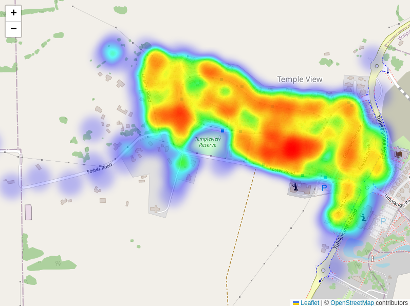

# Vigilantia - Community Crime Reporting & Mapping Platform

Vigilantia is a modern, interactive web application designed to empower communities by providing a platform for reporting and visualizing crime incidents through an intuitive map-based interface. Built with PHP, JavaScript, and modern web technologies, Vigilantia helps create safer neighborhoods through community awareness and data visualization.

Example taken from [Leaflet.heat](https://github.com/Leaflet/Leaflet.heat)

<div align="center">
   <br>
</div>

## 🚀 Quick Start

### Prerequisites

Before you begin, ensure you have the following installed on your system:

- **PHP 8.1+** with SQLite extension
- **Node.js 16+** and npm
- **Composer** (PHP dependency manager)
- **Git** (for cloning the repository)

### Installation

1. **Clone the repository**
   ```bash
   git clone https://github.com/yourusername/vigilantia.git && cd vigilantia
   ```

2. **Install dependencies**
   ```bash
   composer install
   npm install
   ```

3. **Set up environment configuration**
   ```bash
   cp .env.example .env
   # Edit .env file with your configuration if needed
   ```

5. **Initialize the database**
   Use the `./scripts/migrate.php` and `./scripts/seed.ph` to create and seed the sqlite database.

### Usage
#### Development Mode

1. **Start the PHP development server and frontend**
   ```bash
   composer run dev
   npm run parcel
   npm run tailwind
   ```

## Project Structure

```
vigilantia/
├── 📂 assets/            # Source assets (CSS, JS)
│   ├── 📂 css/           # Tailwind CSS source files
│   └── 📂 js/            # JavaScript modules and components
├── 📂 public/            # Web server document root
│   ├── 📂 css/           # Compiled CSS files
│   ├── 📂 js/            # Compiled JavaScript files
│   └── index.php         # Application entry point
├── 📂 src/               # PHP source code
│   ├── 📂 Handlers/      # Request handlers (Controllers)
│   ├── 📂 Resources/     # Data models and database schemas
│   └── 📂 views/         # PHP view templates
├── 📂 uploads/           # User-uploaded files (evidence images)
├── 📄 composer.json      # PHP dependencies
├── 📄 package.json       # Node.js dependencies
├── 📄 database.sqlite    # SQLite database file
└── 📄 config.php         # Application configuration
```

## Contributing

We welcome contributions to make Vigilantia even better! Here's how you can help:

1. **Fork the repository**
2. **Create a feature branch**: `git checkout -b feature/amazing-feature`
3. **Make your changes** and test thoroughly
4. **Commit your changes**: `git commit -m 'Add amazing feature'`
5. **Push to your branch**: `git push origin feature/amazing-feature`
6. **Open a Pull Request**

### Adding New Features

The application follows MVC architecture:

1. **Models**: Add new data models in `src/Resources/`
2. **Views**: Create new templates in `src/views/`
3. **Controllers**: Add request handlers in `src/Handlers/`
4. **Routes**: Register new routes in `public/index.php`

## License

This project is licensed under the MIT License.

## Support

If you encounter any issues or have questions:

1. **Check the Issues** section for known problems and solutions
2. **Create a new issue** with detailed information about your problem
3. **Provide context** including your PHP version, Node.js version, and operating system

## Acknowledgments

- **Leaflet.js** for the excellent mapping library
- **Tailwind CSS** and **DaisyUI** for the beautiful UI components
- **HTMX** for seamless interactive experiences
- **Agmen Framework** for the clean PHP architecture
- **Parcel** for effortless asset bundling

---

**Made with ❤️ for safer communities**
